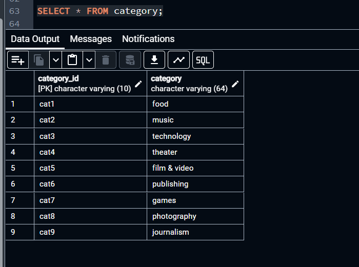

## ETL Mini Project
# Overview
This project involves the extraction, transformation, and loading (ETL) of crowdfunding data from an Excel file into structured DataFrames using Python and the Pandas library.

# Project Structure
Data Source: The project reads data from an Excel file named crowdfunding.xlsx.
DataFrames: The main DataFrame created is crowdfunding_info_df, which contains information about various crowdfunding projects.

# Steps
1. Import Dependencies
import pandas as pd
import numpy as np
2. Extract Data
The data is extracted from the crowdfunding.xlsx file into a Pandas DataFrame.
crowdfunding_info_df = pd.read_excel('Resources/crowdfunding.xlsx')
3. Data Overview
Get a summary of the DataFrame to understand its structure:
crowdfunding_info_df.info()
4. Data Preparation
Create Category and Subcategory DataFrames
A category_df is created with a sequential category_id and unique categories.
A subcategory_df is created with a sequential subcategory_id and unique subcategories.
5. Data Export
Both DataFrames (category_df and subcategory_df) are exported as CSV files:
category.csv
subcategory.csv
6. Unique Categories and Subcategories
The project retrieves unique categories and subcategories and counts their occurrences.
7. Assign Category and Subcategory
New columns for category and subcategory are added to the main DataFrame based on the existing category & sub-category column.

## SQL Schema and Queries
# ERD

# campaign

# category

# contacts

# subcategory

# Conclusion
This ETL mini project demonstrates how to manipulate and prepare crowdfunding data for analysis using Python and Pandas. The structured output allows for further exploration and analysis of the crowdfunding landscape.

# Requirements
Python 3.x
Pandas
NumPy
OpenPyXL (for reading Excel files)
Usage
To run the project, ensure you have the required libraries installed and execute the Jupyter Notebook containing the code.

